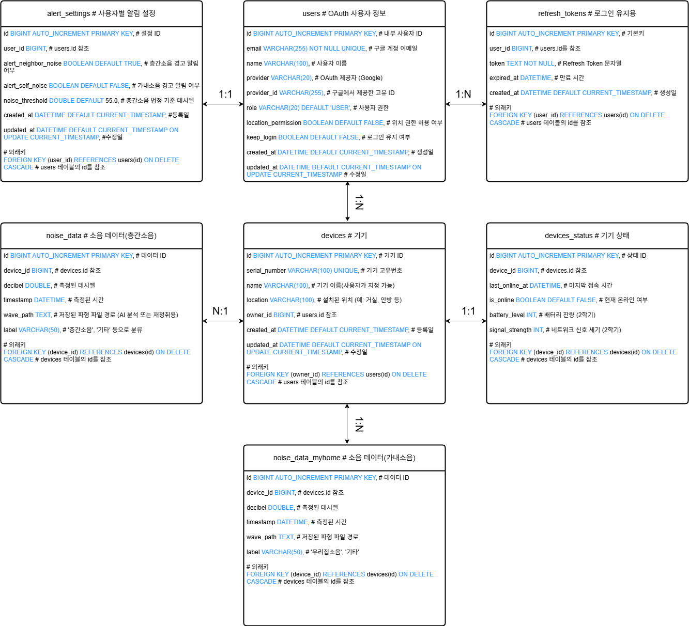

# GoyoHome

GoyoHome App의 Backend 코드가 저장된 Repository입니다.

## 1. Wave 기본 정보 및 공지사항

### 1.1 정기 회의 일정
- 월 13시 ~ 16시
- 목 10시 30분 ~ 13시

### 1.2 백엔드 개발환경
- IDE - IntelliJ
- Language - Java21 이상
- 빌드 도구 - (Gradle – Groovy)
- Framework: Spring boot
- DB: MySQL

---

## 2. 설계 과정

### 2.1 ERD

### 2.2 `application.properties` 초기 설정
<pre><code class="language-properties">
spring.application.name=demo # 애플리케이션 이름

server.port=8080 # http://localhost:8080 입력시 웹페이지 출력

spring.datasource.url=jdbc:mysql://localhost:(포트번호)/(DB이름)?useSSL=false&serverTimezone=Asia/Seoul&characterEncoding=UTF-8&allowPublicKeyRetrieval=true
spring.datasource.username=(사용자명)
spring.datasource.password=(비밀번호)

spring.jpa.hibernate.ddl-auto=update # JPA에 의해 엔티티 클래스에 따라 테이블을 자동으로 업데이트
spring.jpa.show-sql=true # 콘솔에 실행되는 SQL 쿼리를 보여줌
spring.jpa.properties.hibernate.dialect=org.hibernate.dialect.MySQL8Dialect # JPA가 MySQL8에 최적화된 SQL을 생성
</code></pre>

로컬 테스팅 전 괄호의 내용을 각자 자신의 환경에 맞게 수정할 수 있도록 한다.